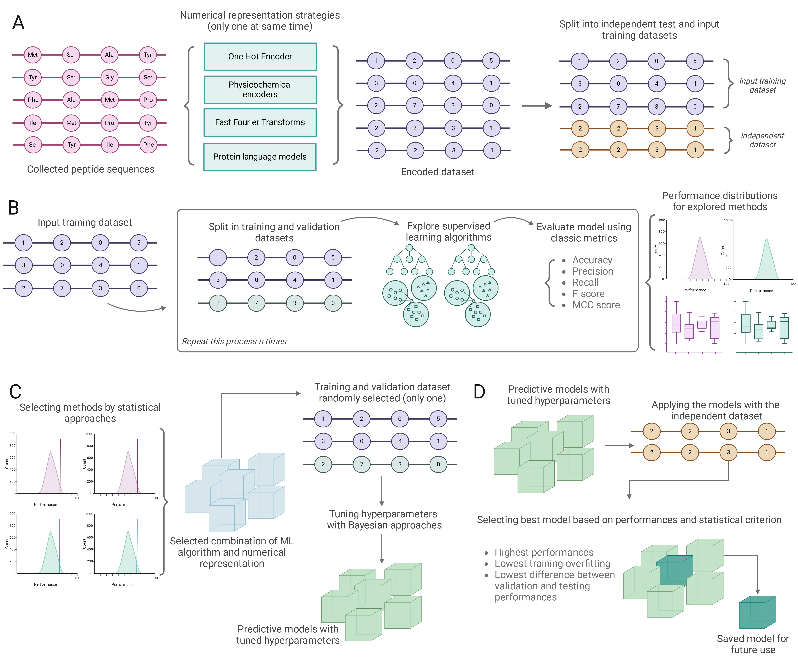

# Discovering potential plastic degrading enzymes using machine learning strategies

This repository contains the source files and supplementary information for the implementations and use cases presented in the work:


David Medina-Ortiz<sup>1,2</sup>, Diego Alvares-Saravia<sup>2,3</sup>, Nicole Soto-García<sup>2</sup>, Diego Sandoval-Vargas<sup>1,4</sup>, Jacqueline Aldridge<sup>2</sup>, Sebastián Rodríguez<sup>1,4</sup>, Bárbara Andrews<sup>1,4</sup>, Juan A. Asenjo<sup>1,4</sup> Anamaría Daza<sup>1,4∗</sup><br>
Discovering potential plastic degrading enzymes using machine learning strategies. <br>
https://doi.org/10.1101/2025.02.09.637306<br>

<sup>*1*</sup><sub>Centre for Biotechnology and Bioengineering, CeBiB, Universidad de Chile, Beauchef 851, Santiago, Chile</sub> <br>
<sup>*2*</sup><sub>Departamento de Ingeniería En Computación, Universidad de Magallanes, Avenida Bulnes 01855, Punta Arenas, Chile.</sub> <br>
<sup>*2*</sup><sub>Centro Asistencial de Docencia e Investigación, CADI, Universidad de Magallanes. Av. Los Flamencos 01364, Punta Arenas, Chile.</sub> <br>
<sup>*4*</sup><sub>Departamento de Ingeniería Química, Biotecnología y Materiales, Universidad de Chile, Beauchef 851, Santiago, Chile</sub> <br>
<sup>*\**</sup><sub>Corresponding author</sub> <br>

---
## Table of Contents
- [A summary of the proposed work](#summary)
- [Requirements and instalation](#requirements)
- [Implemented pipeline](#pipeline)
- [Raw data and preprocessing](#data)
- [Numerical representation strategies](#numerical)
- [Training, selecting, and generating models](#training)
- [References](#references)
---

<a name="summary"></a>

## Discovering potential plastic degrading enzymes using machine learning strategies

Plastic pollution presents a critical environmental challenge, necessitating innovative and sustainable solutions. In this context, biodegradation using microorganisms and enzymes offers an environmentally friendly alternative. This work introduces an AI-driven framework that integrates machine learning (ML) and generative models to accelerate the discovery and design of plastic-degrading enzymes. By leveraging pre-trained protein language models and curated datasets, we developed seven ML-based binary classification models to identify enzymes targeting specific plastic substrates, achieving an average accuracy of 89\%. The framework was applied to over 6,000 enzyme sequences from the RemeDB to classify enzymes targeting diverse plastics, including PET, PLA, and Nylon. Besides, generative learning strategies combined with trained classification models in this work were applied for \textit{de novo} generation of PET-degrading enzymes. Structural bioinformatics validated potential candidates through \textit{in-silico} analysis, highlighting differences in physicochemical properties between generated and experimentally validated enzymes. Moreover, generated sequences exhibited lower molecular weights and higher aliphatic indices, features that may enhance interactions with hydrophobic plastic substrates. These findings highlight the utility of AI-based approaches in enzyme discovery, providing a scalable and efficient tool for addressing plastic pollution. Future work will focus on experimental validation of promising candidates and further refinement of generative strategies to optimize enzymatic performance. 

<a name="requirements"></a>

## Requirements

This work was implemented on Python v3.12. To facilitate the deployment and the replication of the work, an [environment file](environment.yml) was constructed 

To create the environment, please run the following command: 

```
conda create -f environment.yml
```

Moreover, if you want to check all generated embedding and numerical representation strategies, you can find it as a tar.gz files in the shared [Google Drive folder](https://drive.google.com/drive/folders/1ntv4T_ypvuOBGmSrRN5pqi1ydBIBcrmp?usp=sharing).

<a name="pipeline"></a>

## Implemented pipeline to train classification models

The implemented pipeline to train the classification models is based on our previous work [2]



<a name="data"></a>

## Raw data and processing strategies

The folder [raw_data](raw_data) contains:
- **enzymes_plastics**: pivoted csv file with each plastic-substrate target detected 
- **data_sequences**: csv file with unique sequences collected from the pivoted dataset
- **reme_db_sequences**: csv file with plastic-degrading enzymes extracted from RemeDB [3]

<a name="numerical"></a>

## Numerical representation strategies explored in this work

This work explores different numerical representation strategies to process the input enzyme sequences. See the notebooks in folder [encoding_approaches](src/encoding_approaches) for details about the execution.

The encoding strategies including:

1. Feature engineering
2. Frequency encoders
3. k-mers encoders
4. One-hot encoders
5. Ordinal encoders
6. Physicochemical-based encoders
7. FFT-based encoders
8. Embeddings throug pre-trained protein language models.

- In the case of physicochemical-based and FFT-based the physicochemical properties encoders used were extracted from [4]. 

- In the case of embedding, the bioembedding library was employed [5].

The numerical representation strategies take the input data [input_data](raw_data/data_sequences.csv), apply the encoder strategy, and generate the outputs with the encoder sequences. The folder [processed_dataset](processed_dataset) contains the results of all encoder strategies explored in this work.

<a name="training"></a>

## Training strategies applied to develop classification models

This work explores different supervised learning strategies to train binary classification models. The folder [train_models](src/train_models/) has the script implemented for the development of classification models, including:

- classification_models.py
- training_model.py
- run_training_process.py
- merging_performances_by_plastic.ipynb

The script training_model.py facilitate the training during exploration step for all type of plastic explored in this work.

Besides, in the folder [selecting_models](src/selecting_models/) you will find scripts for analyzing the results of the exploration performances and for selecting the best combinations of supervised learning algorithms and numerical representation strategies.

Finally, the folder [checking_and_characterizing_models](src/checking_and_characterizing_models/) facilitates the processing, voting, and genering the trained models to use to classify new sequences.

These models were used for analyzing:

- Generated sequences throug the pre-trained model ZymCTRL [6]. The folder [generating_sequences](src/generating_sequences/) contain the scripts implemented for the enzyme sequences generation
- Plastic-degrading enzymes with unknown plastic-substrate target collected from RemeDB [7]

See folder [exploring_generated_sequences](src/exploring_generated_sequences/) for more details. These scripts facilitate:

- Loading enzyme sequences previously encoded
- Loading models
- Using the models for predicting with classification and probabilities
- Filter the classification based on a threshold (default threshold=0.5)

<a name="references"> </a>

## References

- [1] Dallago, C., Schütze, K., Heinzinger, M., Olenyi, T., Littmann, M., Lu, A. X., ... & Rost, B. (2021). Learned embeddings from deep learning to visualize and predict protein sets. Current Protocols, 1(5), e113.
- [2] Medina-Ortiz, D., Contreras, S., Fernández, D., Soto-García, N., Moya, I., Cabas-Mora, G., & Olivera-Nappa, Á. (2024). Protein language models and machine learning facilitate the identification of antimicrobial peptides. International Journal of Molecular Sciences, 25(16), 8851.
- [3] Sankara Subramanian, S. H., Balachandran, K. R. S., Rangamaran, V. R., & Gopal, D. (2020). RemeDB: tool for rapid prediction of enzymes involved in bioremediation from high-throughput metagenome data sets. Journal of Computational Biology, 27(7), 1020-1029.
- [4] Medina-Ortiz, D., Contreras, S., Amado-Hinojosa, J., Torres-Almonacid, J., Asenjo, J. A., Navarrete, M., & Olivera-Nappa, Á. (2022). Generalized property-based encoders and digital signal processing facilitate predictive tasks in protein engineering. Frontiers in Molecular Biosciences, 9, 898627.
- [5] Dallago, C., Schütze, K., Heinzinger, M., Olenyi, T., Littmann, M., Lu, A. X., ... & Rost, B. (2021). Learned embeddings from deep learning to visualize and predict protein sets. Current Protocols, 1(5), e113.
- [6] Munsamy, G., Lindner, S., Lorenz, P., & Ferruz, N. (2022, December). ZymCTRL: a conditional language model for the controllable generation of artificial enzymes. In NeurIPS Machine Learning in Structural Biology Workshop.
- [7] Sankara Subramanian, S. H., Balachandran, K. R. S., Rangamaran, V. R., & Gopal, D. (2020). RemeDB: tool for rapid prediction of enzymes involved in bioremediation from high-throughput metagenome data sets. Journal of Computational Biology, 27(7), 1020-1029.
